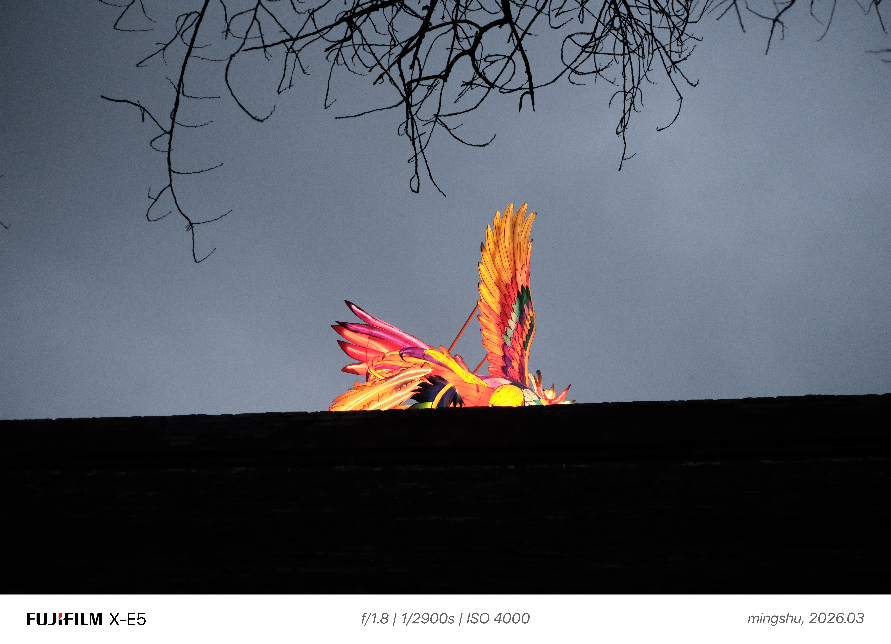

# Photo Watermark

为照片添加专业水印的工具，支持自动提取 EXIF 数据并生成带有相机品牌 Logo 和拍摄参数的白边底框水印。

## 功能特性

- **自动提取 EXIF 数据**：读取照片中的相机型号、光圈、快门速度、ISO 等元数据
- **智能品牌识别**：根据相机信息自动匹配品牌 Logo
- **专业水印布局**：白色底框 + 左侧品牌 Logo 和型号 + 右侧拍摄参数
- **多品牌支持**：Sony、Fujifilm、Nikon、Canon、Panasonic、vivo、Apple、Huawei

## 效果展示

### 示例 1



### 示例 2


水印包含：
- **左侧**：相机品牌 Logo + 相机型号
- **右侧**：光圈 | 快门速度 | ISO 参数

## 安装

### 依赖

```bash
pip install Pillow
```

## 使用方法

### 命令行方式

```bash
# 基本用法（输出到同名文件_watermarked.jpg）
python photo-watermark/scripts/add_photo_watermark.py photo.jpg

# 指定输出文件名
python photo-watermark/scripts/add_photo_watermark.py photo.jpg output.jpg
```

### Python 脚本方式

```python
import sys
sys.path.append('photo-watermark/scripts')
from add_photo_watermark import add_watermark_to_image

# 为照片添加水印
add_watermark_to_image("photo.jpg", "output.jpg", border_size=120)
```

## 支持的相机品牌

| 品牌 | 识别模式 | Logo 样式 |
|------|---------|----------|
| Sony | Sony, α, Alpha | 黑色 "SONY" 文字 |
| Fujifilm | Fujifilm, Fuji, GFX, X-T, X-Pro | 蓝色圆形 + 白色 "F" |
| Nikon | Nikon, Z, D, Coolpix | 黄色圆形 + 黑色 "NIKON" |
| Canon | Canon, EOS, PowerShot | 红色 "Canon" 文字 |
| Panasonic | Panasonic, Lumix, Leica | 蓝色 "LUMIX" 文字 |
| vivo | vivo, X, S, Y | 蓝色圆形 + 白色 "vivo" |
| Apple | Apple, iPhone, iPad | 黑色苹果图标 |
| Huawei | Huawei, P, Mate, Honor | 红色 "HUAWEI" 文字 |

## 参数说明

- `input_image_path`: 输入图片路径
- `output_image_path`: 输出图片路径（可选，默认为 `原文件名_watermarked.jpg`）
- `border_size`: 水印底框高度（默认 120 像素）

## 自定义配置

可修改 `scripts/add_photo_watermark.py` 中的参数：

```python
# 底框高度
border_size = 120  # 像素

# 字体大小
left_font_size = max(24, int(border_size * 0.35))   # 相机型号字体
right_font_size = max(20, int(border_size * 0.30))  # 参数字体

# Logo 大小
logo_size = (int(border_size * 0.5), int(border_size * 0.5))
```

## 生成品牌 Logo

如需重新生成品牌 Logo 文件：

```bash
python photo-watermark/scripts/generate_logos.py
```

## 项目结构

```
photo-watermark/
├── README.md                    # 项目说明文档
├── photo-watermark/             # Skill 目录
│   ├── SKILL.md                 # Skill 说明文档
│   ├── assets/
│   │   ├── temp_photo2_watermarked_v11.jpg  # 效果展示图片1
│   │   ├── IMG_0776_watermarked.JPG         # 效果展示图片2
│   │   └── logos/               # 品牌Logo图片
│   │       ├── sony.png
│   │       ├── fujifilm.png
│   │       ├── nikon.png
│   │       ├── canon.png
│   │       ├── panasonic.png
│   │       ├── vivo.png
│   │       ├── apple.png
│   │       └── huawei.png
│   ├── scripts/
│   │   ├── add_photo_watermark.py   # 主水印脚本
│   │   └── generate_logos.py        # Logo生成器
│   └── references/
│       └── api_reference.md     # API参考文档
└── photo-watermark.skill        # 打包的Skill文件
```

## 支持的图片格式

- JPEG（推荐）
- PNG
- TIFF
- BMP
- 其他 PIL 支持的格式

**注意**：输出始终为 JPEG 格式，质量设置为 95%。

## 边界情况处理

| 情况 | 处理方式 |
|------|---------|
| 无 EXIF 数据 | 显示 "Unknown Camera" 和 "N/A" 参数 |
| 未知品牌 | 显示相机型号文字，不显示 Logo |
| 部分参数缺失 | 缺失参数显示为 "N/A" |

## 许可证

MIT License

## 贡献

欢迎提交 Issue 和 Pull Request！
